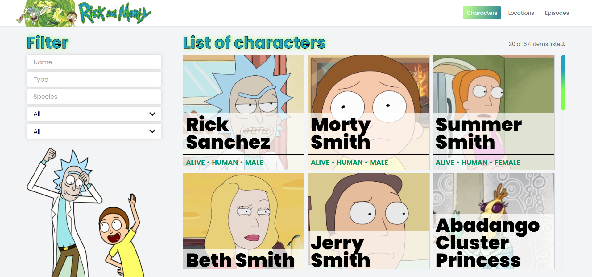
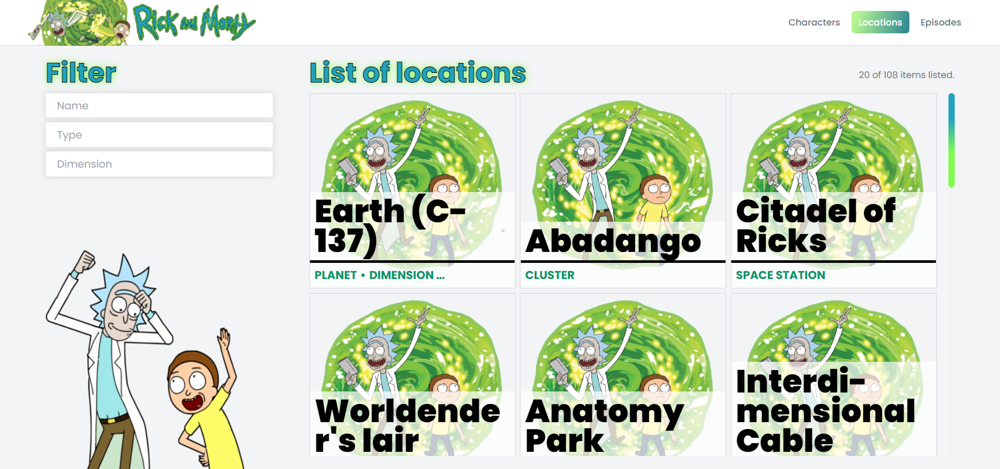
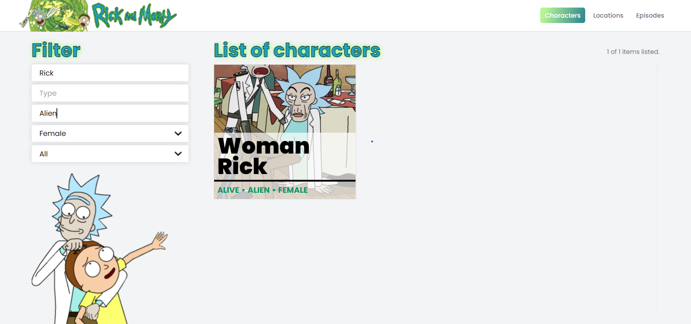
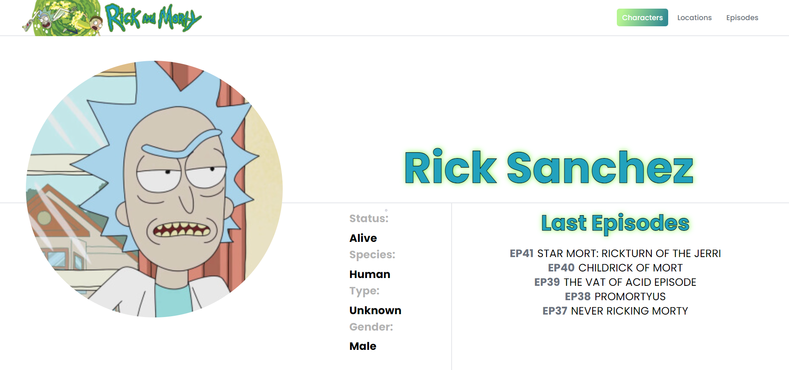
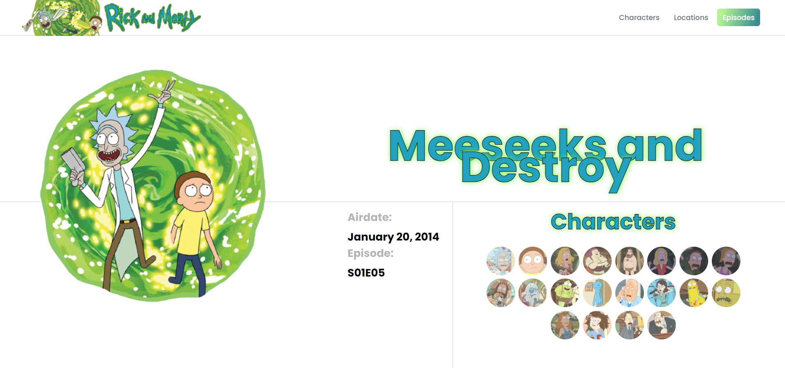
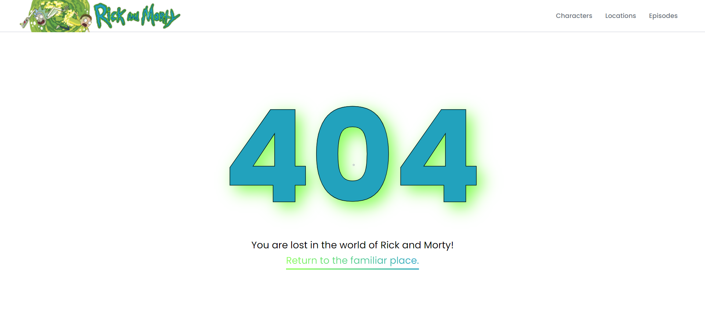

# React Rick and Morty App

This project includes listing, filtering and showing details of Rick and Morty data fetched from [API](https://rickandmortyapi.com/). It is a **React** project and built with **create-react-app**. While coding, **ESLint** and **Prettier** were used together with the **AirBnb** style guide. The tests were done with **jest** and **testing-library**. [Demo](https://enesbaspinar.me/rick-and-morty).

## Using Packages

- eslint + prettier + airbnb
- gh-pages
- jest
- react-infinite-scroll-component
- react-testing-library
- react-router-dom
- sass
- testing-library
- tailwindcss

## Installation

You can download the project by cloning it from the Github site or by typing the following command:

```console
git clone https://github.com/baspinarenes/rick-and-morty
```

## Run Project

In the project directory you can run the following lines:

```console
npm install
npm start
```

## Screenshots







